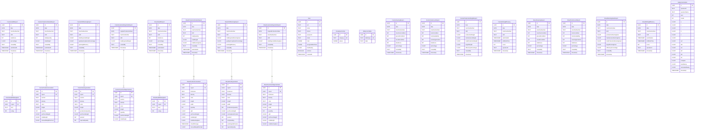

# Database Schema - ER Diagram

```mermaid
erDiagram
    FrameHealthReport ||--o{ FrameHealthRatingItem : "has"
    FrameProductionDetailsReport ||--o{ FrameProductionLineItem : "has"
    FrameShiftPackingReport ||--o{ FramePackingLineItem : "has"
    FrameCustomerRejectionReport ||--o{ FrameCustomerRejectionItem : "has"
    SheetHealthReport ||--o{ SheetHealthRatingItem : "has"
    SheetProductionDetailsReport ||--o{ SheetProductionLineItem : "has"
    SheetShiftPackingReport ||--o{ SheetPackingLineItem : "has"
    SheetCustomerRejectionReport ||--o{ SheetCustomerRejectionItem : "has"

    User {
        UUID id PK
        TEXT uid UK
        TEXT name
        TEXT phone
        TEXT password
        TEXT email
        JSONB roles
        JSONB assignedMachines
        FLOAT fixedSalary
        BOOLEAN isActive
        TIMESTAMP createdAt
    }
    DropdownConfig {
        UUID id PK
        TEXT category UK
        JSONB values
    }
    ReferenceTable {
        UUID id PK
        TEXT tableType UK
        TEXT data
    }
    FrameCleaningReport {
        UUID id PK
        DATE date
        TEXT machineNumber
        INT machineCondition
        INT groundCondition
        INT mouldCondition
        INT totalScore
        FLOAT percentage
        TEXT createdBy
        TIMESTAMP timestamp
    }
    FrameToolsCountReport {
        UUID id PK
        DATE date
        TEXT machineNumber
        INT toolsCondition
        INT toolsAvailability
        INT toolsOrganization
        INT totalScore
        FLOAT percentage
        TEXT createdBy
        TIMESTAMP timestamp
    }
    FrameHealthRatingItem {
        UUID id PK
        UUID report FK
        TEXT item
        INT rating
    }
    FrameHealthReport {
        UUID id PK
        DATE date
        TEXT machineNumber
        TEXT shift
        INT totalScore
        FLOAT percentage
        TEXT createdBy
        TIMESTAMP submittedAt
        TIMESTAMP timestamp
    }
    FrameProductionLineItem {
        UUID id PK
        UUID report FK
        TEXT section
        TEXT density
        TEXT color
        FLOAT length
        INT quantity
        FLOAT perPieceWeight
        FLOAT totalWeight
        FLOAT manualWeightPerFoot
    }
    FrameProductionDetailsReport {
        UUID id PK
        DATE date
        TEXT machineNumber
        TEXT shift
        INT totalQuantity
        FLOAT totalWeight
        TEXT createdBy
        TIMESTAMP submittedAt
        TIMESTAMP timestamp
    }
    FrameProductionWeightReport {
        UUID id PK
        DATE date
        TEXT machineNumber
        TEXT shift
        FLOAT productionWeight
        FLOAT maintenanceWeight
        FLOAT totalProductionWeight
        FLOAT targetWeight
        FLOAT efficiencyPercentage
        TEXT createdBy
        TIMESTAMP timestamp
    }
    FramePackingLineItem {
        UUID id PK
        UUID report FK
        TEXT section
        TEXT density
        TEXT color
        FLOAT length
        INT productionQuantity
        FLOAT perPieceWeight
        INT packed
        INT rejectedQuality
    }
    FrameShiftPackingReport {
        UUID id PK
        DATE date
        TEXT machineNumber
        TEXT shift
        FLOAT totalRejectedWeight
        FLOAT qualityAcceptancePercentage
        FLOAT packingEfficiency
        TEXT createdBy
        TIMESTAMP timestamp
    }
    FrameWritingEfficiency {
        UUID id PK
        DATE date
        TEXT machineNumber
        TEXT shift
        TIMESTAMP submittedAt
        TIMESTAMP shiftEndTime
        INT score
        TEXT operatorId
        TIMESTAMP timestamp
    }
    FrameCustomerRejectionItem {
        UUID id PK
        UUID report FK
        TEXT section
        TEXT density
        TEXT color
        FLOAT length
        INT quantity
        FLOAT perPieceWeight
        FLOAT totalWeight
    }
    FrameCustomerRejectionReport {
        UUID id PK
        DATE originalProductionDate
        TEXT machineNumber
        TEXT shift
        FLOAT totalRejectedWeight
        TEXT createdBy
        TIMESTAMP timestamp
    }
    SheetCleaningReport {
        UUID id PK
        DATE date
        TEXT machineNumber
        INT machineCondition
        INT groundCondition
        INT mouldCondition
        INT totalScore
        FLOAT percentage
        TEXT createdBy
        TIMESTAMP timestamp
    }
    SheetToolsCountReport {
        UUID id PK
        DATE date
        TEXT machineNumber
        INT toolsCondition
        INT toolsAvailability
        INT toolsOrganization
        INT totalScore
        FLOAT percentage
        TEXT createdBy
        TIMESTAMP timestamp
    }
    SheetHealthRatingItem {
        UUID id PK
        UUID report FK
        TEXT item
        INT rating
    }
    SheetHealthReport {
        UUID id PK
        DATE date
        TEXT machineNumber
        TEXT shift
        INT totalScore
        FLOAT percentage
        TEXT createdBy
        TIMESTAMP submittedAt
        TIMESTAMP timestamp
    }
    SheetProductionLineItem {
        UUID id PK
        UUID report FK
        TEXT thickness
        TEXT density
        TEXT color
        FLOAT length
        FLOAT width
        INT quantity
        FLOAT sqft
        FLOAT perPieceWeight
        FLOAT totalWeight
        FLOAT totalRunningFeet
        TIMESTAMP timeOfChange
        FLOAT manualWeightPerSqft
    }
    SheetProductionDetailsReport {
        UUID id PK
        DATE date
        TEXT machineNumber
        TEXT shift
        INT totalQuantity
        FLOAT totalWeight
        FLOAT totalRunningFeet
        TEXT createdBy
        TIMESTAMP submittedAt
        TIMESTAMP timestamp
    }
    SheetRunningFeetReport {
        UUID id PK
        DATE date
        TEXT machineNumber
        TEXT shift
        FLOAT productionRunningFeet
        FLOAT maintenanceRunningFeet
        FLOAT totalProductionRunningFeet
        FLOAT targetRunningFeet
        FLOAT efficiencyPercentage
        TEXT createdBy
        TIMESTAMP timestamp
    }
    SheetPackingLineItem {
        UUID id PK
        UUID report FK
        TEXT thickness
        TEXT density
        TEXT color
        FLOAT length
        FLOAT width
        INT productionQuantity
        FLOAT perPieceWeight
        FLOAT runningFeetPerItem
        INT packed
        INT onlySanding
        INT sandingAndPacked
        INT rejectedQuality
    }
    SheetShiftPackingReport {
        UUID id PK
        DATE date
        TEXT machineNumber
        TEXT shift
        FLOAT totalRejectedRunningFeet
        FLOAT qualityAcceptancePercentage
        FLOAT packingEfficiency
        TEXT createdBy
        TIMESTAMP timestamp
    }
    SheetWritingEfficiency {
        UUID id PK
        DATE date
        TEXT machineNumber
        TEXT shift
        TIMESTAMP submittedAt
        TIMESTAMP shiftEndTime
        INT score
        TEXT operatorId
        TIMESTAMP timestamp
    }
    SheetCustomerRejectionItem {
        UUID id PK
        UUID report FK
        TEXT thickness
        TEXT density
        TEXT color
        FLOAT length
        FLOAT width
        INT quantity
        FLOAT sqft
        FLOAT perPieceWeight
        FLOAT totalWeight
        FLOAT totalRunningFeet
    }
    SheetCustomerRejectionReport {
        UUID id PK
        DATE originalProductionDate
        TEXT machineNumber
        TEXT shift
        FLOAT totalRejectedRunningFeet
        TEXT createdBy
        TIMESTAMP timestamp
    }
    SalaryCalculation {
        UUID id PK
        TEXT operatorId
        TEXT operatorName
        INT year
        INT month
        FLOAT a
        FLOAT b
        FLOAT c
        FLOAT d
        FLOAT e
        FLOAT f
        FLOAT wA
        FLOAT wB
        FLOAT wC
        FLOAT wD
        FLOAT wE
        FLOAT wF
        FLOAT multiplier
        FLOAT fixedSalary
        FLOAT calculatedSalary
        TIMESTAMP timestamp
    }
```
